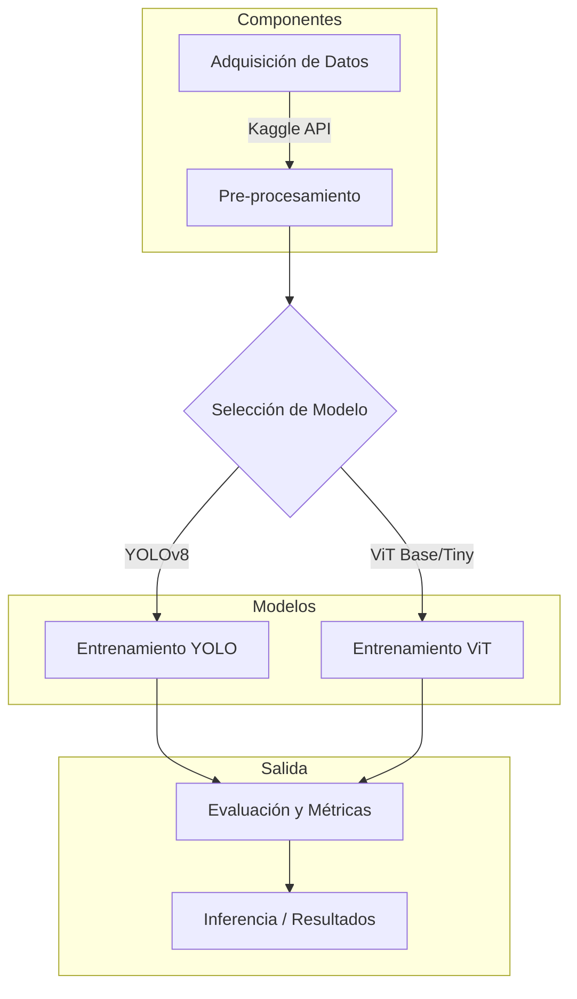

# Informe Técnico: Clasificación de Imágenes Satelitales EuroSat

## 1. Objetivo del Proyecto
El objetivo principal de este proyecto es desarrollar y evaluar modelos de aprendizaje profundo para la clasificación automática de imágenes satelitales del conjunto de datos EuroSat. Se busca identificar diferentes tipos de uso del suelo y cobertura terrestre (e.g., Bosques, Ríos, Zonas Industriales) utilizando arquitecturas de vanguardia como Vision Transformers (ViT) y YOLO (You Only Look Once), con el fin de comparar su desempeño en términos de precisión y eficiencia.

## 2. Arquitectura General

El flujo de trabajo del proyecto sigue una arquitectura estándar de aprendizaje automático, desde la adquisición de datos hasta la evaluación del modelo.

### Descripción de Componentes:
*   **Adquisición de Datos**: Descarga automatizada del dataset EuroSat desde Kaggle utilizando `kagglehub`.
*   **Pre-procesamiento**:
    *   Conversión de imágenes a formato RGB.
    *   Redimensionamiento (Resize) a 224x224 (ViT) o 128x128 (YOLO).
    *   Normalización de píxeles.
    *   División en conjuntos de entrenamiento, validación y prueba.
*   **Modelos**:
    *   **YOLOv8n-cls**: Modelo de clasificación de Ultralytics, optimizado para velocidad y eficiencia.
    *   **ViT (Vision Transformer)**: Modelos basados en la arquitectura Transformer (Base y Tiny) de Hugging Face, que procesan imágenes como secuencias de parches.
*   **Entrenamiento**: Scripts dedicados para ajustar los pesos de los modelos utilizando los datos procesados.
*   **Evaluación**: Cálculo de métricas de precisión (Accuracy) y generación de matrices de confusión.

## 3. Implementación Técnica

El proyecto está implementado en Python, utilizando las siguientes herramientas y bibliotecas clave:

*   **Lenguaje**: Python 3.x
*   **Frameworks de Deep Learning**:
    *   `torch` (PyTorch): Motor principal de cálculo tensorial.
    *   `transformers` (Hugging Face): Para la implementación y entrenamiento de modelos ViT.
    *   `ultralytics`: Para la implementación y entrenamiento de YOLOv8.
*   **Gestión de Datos**:
    *   `datasets` (Hugging Face): Para carga y manipulación eficiente de datos.
    *   `pandas`: Para manejo de metadatos en CSV.
    *   `kagglehub`: Para descarga del dataset.
*   **Evaluación**:
    *   `evaluate`: Biblioteca de Hugging Face para cálculo de métricas.
    *   `scikit-learn`: Para métricas adicionales si es necesario.

### Módulos Clave:
*   `src/data/download_dataset.py`: Script para descargar y organizar el dataset EuroSat.
*   `src/models/YOLO/train_model.py`: Script de entrenamiento para YOLOv8.
*   `src/models/vit_base/train_model.py`: Script de entrenamiento para ViT Base.
*   `src/models/vit_tiny/train_model.py`: Script de entrenamiento para ViT Tiny.

## 4. Evaluación

La evaluación de los modelos se realiza principalmente mediante la métrica de **Exactitud (Accuracy)**, midiendo el porcentaje de imágenes clasificadas correctamente.

### Métricas de Desempeño:

| Modelo | Epocas | Accuracy (Top-1) | Accuracy (Top-3) | Observaciones |
| :--- | :--- | :--- | :--- | :--- |
| **YOLOv8n-cls** | 5 | **96.0%** | **99.96%** | Entrenamiento rápido, alta precisión. Menos de 10 minutos de entrenamiento. |
| **ViT Base** | 50 | **0.9885** | **0.9993** | Entrenamiento más lento, arquitectura compleja. Aproximadamente 14 horas de entrenamiento. |
| **ViT Tiny** | 15 | **0.9874** | **0.9985** | Versión ligera de ViT. Aproximadamente 3 horas de entrenamiento. |

## 5. Resultados y Ejemplos

### Resultados de YOLO
A continuación se presentan los resultados visuales obtenidos con el modelo YOLO.

#### Matriz de Confusión (YOLO)
La matriz de confusión muestra el desempeño del modelo en cada una de las clases. Se observa una diagonal dominante, indicando una alta tasa de aciertos.

#### Recall por Clase (YOLO)
Grafico de barras que muestra el recall por clase.

### Resultados de ViT Base
A continuación se presentan los resultados visuales obtenidos con el modelo ViT Base.

#### Matriz de Confusión (ViT Base)
La matriz de confusión muestra el desempeño del modelo en cada una de las clases. Se observa una diagonal dominante, indicando una alta tasa de aciertos.

#### Recall por Clase (ViT Base)
Grafico de barras que muestra el recall por clase.

### Resultados de ViT Tiny
A continuación se presentan los resultados visuales obtenidos con el modelo ViT Tiny.

#### Matriz de Confusión (ViT Tiny)
La matriz de confusión muestra el desempeño del modelo en cada una de las clases. Se observa una diagonal dominante, indicando una alta tasa de aciertos.

#### Recall por Clase (ViT Tiny)
Grafico de barras que muestra el recall por clase.

## 6. Conclusiones y Mejoras Futuras

### Conclusiones:
*   El modelo **YOLOv8n-cls** demostró ser altamente efectivo para la tarea de clasificación de EuroSat, alcanzando un 96% de precisión en solo 5 épocas.
*   La arquitectura del proyecto es modular, permitiendo fácil integración de nuevos modelos.
*   El uso de herramientas como Hugging Face y Ultralytics simplifica significativamente el flujo de trabajo de entrenamiento.
*   El modelo **ViT Base** demostró ser altamente efectivo para la tarea de clasificación de EuroSat, alcanzando un 98.85% de precisión en solo 50 épocas siendo más lento que el modelo YOLOv8n-cls.
*   El modelo **ViT Tiny** demostró ser altamente efectivo para la tarea de clasificación de EuroSat, alcanzando un 98.74% de precisión en solo 15 épocas siendo más rápido que el modelo ViT Base. Y con una precisión similar al modelo ViT Base, demostrando que para este problema usar el modelo ViT Tiny es una mejora en términos de velocidad.

### Mejoras Futuras:
*   **Aumento de Datos (Data Augmentation)**: Implementar técnicas más agresivas de aumento de datos para mejorar la robustez.
*   **Ajuste de Hiperparámetros**: Realizar una búsqueda sistemática (Grid Search / Bayesian Optimization) para optimizar learning rate, batch size, etc.
*   **Ensamble de Modelos**: Combinar las predicciones de YOLO y ViT para mejorar la precisión final.
*   **Despliegue**: Crear una API REST (con FastAPI o Flask) para servir los modelos en producción.

## 7. Planificación del Equipo

Estado actual y planificación de tareas para el equipo de desarrollo.

| Tarea | Responsable | Estado | Prioridad |
| :--- | :--- | :--- | :--- |
| **Adquisición y Limpieza de Datos** | Amilcar | Completado | Alta |
| **Implementación YOLOv8** | Amilcar | Completado | Alta |
| **Implementación ViT (Base/Tiny)** | Julián | Completado | Alta |
| **Entrenamiento de Modelos** | Julián - Amilcar | Completado | Alta |
| **Evaluación y Comparación** | Jorge | En Progreso | Media |
| **Generación de Informe Técnico** | Jorge - Julián | En Progreso | Media |
| **Optimización de Hiperparámetros** | -- | Pendiente | Baja |
| **Despliegue de API** | -- | Pendiente | Baja |

